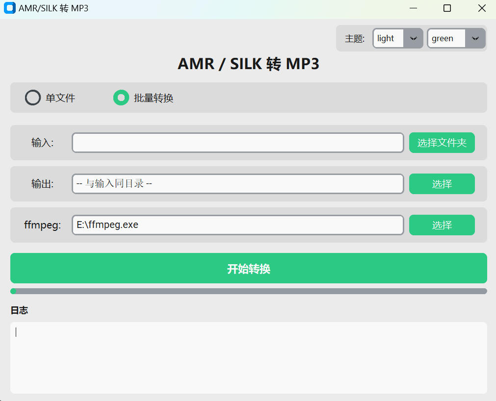

# AMR / SILK → MP3 转换工具

专门解决 **QQ、微信** 语音文件（SILK 编码的伪 AMR 文件）无法直接播放的问题，同时也支持普通 AMR 格式。

## 支持格式

| 来源 | 格式 | 处理说明 |
|------|------|----------|
| QQ 语音 | SILK v3 编码 | silk 解码 → PCM → MP3 |
| 微信语音 | SILK v3 编码 | silk 解码 → PCM → MP3 |
| 普通 AMR | AMR-NB / AMR-WB | ffmpeg 直接转换 |

## 截图



## 使用方式

### 方式一：编译版 exe（推荐）

前往 [Releases](../../releases) 下载发布包，解压后双击 `AMR转MP3.exe` 即可运行。

**发布包结构：**
```
AMR转MP3/
├── AMR转MP3.exe        ← 双击运行
├── ffmpeg.exe          ← 必须项，音频转码
└── silk_decoder.exe    ← 必须项，SILK 格式解码
```

> **注意：** `ffmpeg.exe` 和 `silk_decoder.exe` 是转换所必须的外部依赖，
> 删除后程序无法运行。两个文件需与 exe 放在同一目录。

### GitHub Actions 自动打包

推送到 `main` 分支后，GitHub Actions 会自动构建 Windows 版本。也可以在
仓库的 **Actions → Build Windows release → Run workflow** 中手动运行。
构建完成后，在对应运行页面的 **Artifacts** 区域下载 `AMR-MP3-Windows`。
推送 `v*` 版本标签时，还会自动创建 GitHub Release 并附上永久下载包。

### 方式二：源码运行

```bash
# 1. 安装依赖
pip install customtkinter

# 2. 确保同目录下有 ffmpeg.exe 和 silk_decoder.exe

# 3. 启动
python amr_to_mp3_gui.py    # 图形界面
python amr_to_mp3.py        # 命令行
```

**命令行用法：**
```bash
# 单文件转换
python amr_to_mp3.py -i voice.amr
python amr_to_mp3.py -i voice.silk

# 批量转换
python amr_to_mp3.py -i ./audio_folder
python amr_to_mp3.py -i ./audio_folder -o ./output_folder
```

批量转换会识别目录中的 `.amr` 和 `.silk` 文件，扩展名大小写均可。

## 依赖说明

程序依赖以下两个外部工具，**必不可少**：

| 文件 | 用途 |
|------|------|
| `ffmpeg.exe` | 音频转码为 MP3 |
| `silk_decoder.exe` | 解码 QQ/微信 SILK v3 格式 |

源码和编译版发布包均已包含这两个文件，直接运行即可。

## 转换原理

```
.silk/.amr 文件
    │
    ├─ 检测到 #!SILK_V3  →  silk_decoder.exe  →  PCM → ffmpeg → .mp3
    │
    └─ 标准 AMR          →  ffmpeg 直接转换  → .mp3
```

## 目录结构

```
├── amr_to_mp3.py        # 命令行版本
├── amr_to_mp3_gui.py    # 图形界面版本
├── ffmpeg.exe           # 必须项：音频转码
└── silk_decoder.exe     # 必须项：SILK 格式解码
```

## License

[MIT License](LICENSE)
